# video_viewer

<br>

## My other APIs

- [Scroll Navigation](https://pub.dev/packages/scroll_navigation)
- [Video Editor](https://pub.dev/packages/video_editor)
- [Helpers](https://pub.dev/packages/helpers)

<br>

## Features

- Amazing UI / UX.
- Fancy animations.
- Fully customizable.
- Multiplataform support.
- HLS (m3u8) format support.
- Captions (Subtitles) support.
- Easy and powerful implementation! :)

<br><br>

## **INSTALLATION**

First, add `video_viewer` as a dependency in your **pubspec.yaml.**

```yaml
dependencies:
  video_viewer: ^1.0.9
```

### Android

Add _android.permission.INTERNET_ and _usesCleartextTraffic_ in your **Android Manifest** file, located in `<project_root>/android/app/src/main/AndroidManifest.xml`

```xml
<manifest>
    <uses-permission android:name="android.permission.INTERNET"/>
    <application android:usesCleartextTraffic="true"></aplication>
</manifest>
```

### iOS

Add the following entry to your **Info.plist** file, located in `<project_root>/ios/Runner/Info.plist`

```xml
<key>NSAppTransportSecurity</key>
<dict>
   <key>NSAllowsArbitraryLoads</key>
   <true/>
</dict>
```

**Warning:** The video player is not functional on **iOS simulators.** An iOS device must be used during development/testing.

<br><br>

## **GLOBAL GESTURES**

- **One Tap:** Show or hide the overlay that contains the PlayAndPauseWidget and the ProgressBar
- **Double tap:**
  - Left: Double tapping on the left side of the VideoViewer will do the **rewind**. Default 10 seconds.
  - Right: Double-tapping on the right side of the VideoViewer will **forward**. Default 10 seconds.
- **Horizontal Drag:**
  - Left: Making a horizontal movement to the left will make a **rewind** proportional to the distance traveled.
  - Right: Making a horizontal movement to the right will make a **forward** proportional to the distance traveled.
- **Vertical Drag:**
  - Up: **Increase** video **volume** proportional to the distance traveled.
  - Down: **Decrease** video **volume** proportional to the distance traveled.
- **Scale Drag:** When the VideoViewer is on fullscreen and landscape mode you can zoom to video for completing the screen width.

<br><br>

## **ANDROID AND IOS**

|                Playing                 |                Paused                 |
| :------------------------------------: | :-----------------------------------: |
| 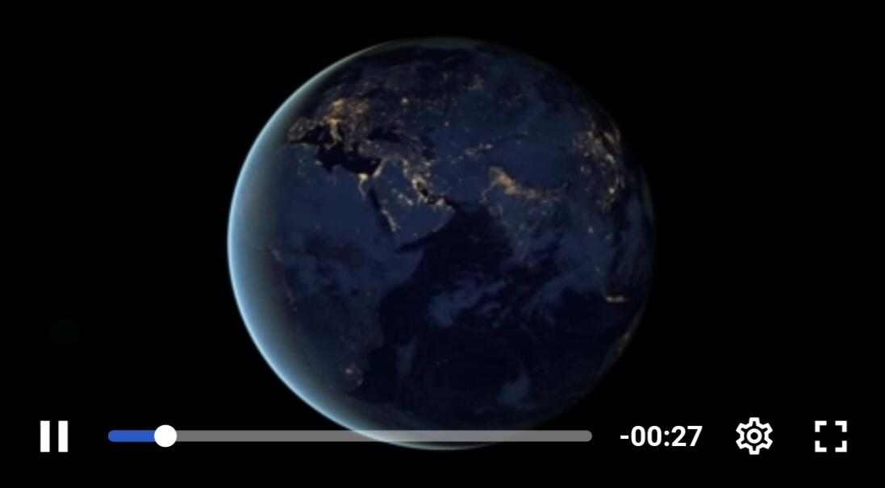 | 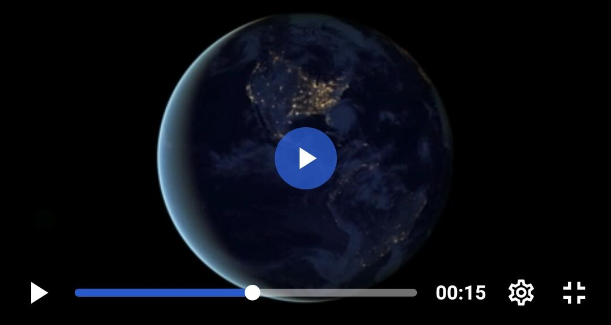 |

<br><br>

#### Rewind and Forward

|           Double Tap Rewind           |           Double Tap Forward           |
| :-----------------------------------: | :------------------------------------: |
|  | 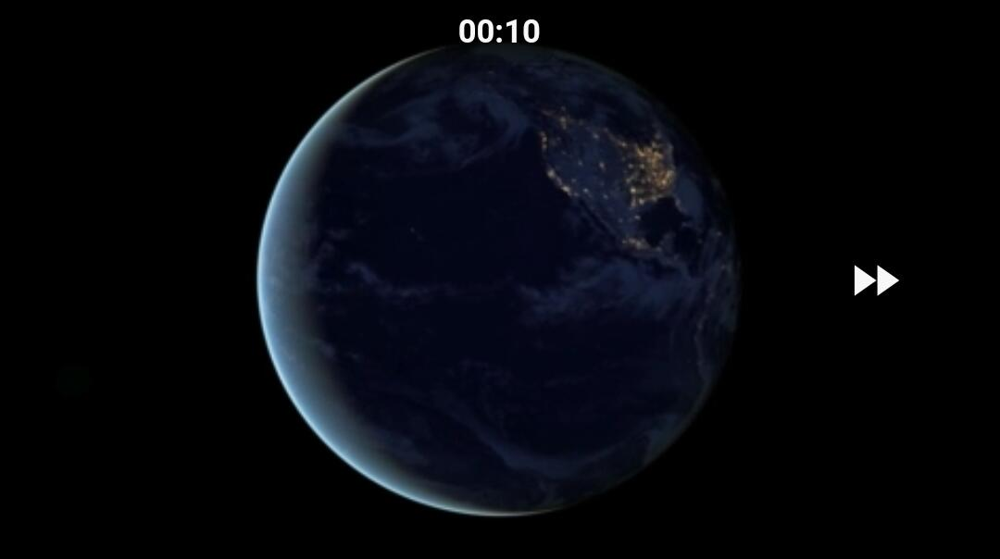 |

<br><br>

### Fullscreen

|                      Portrait                      |                      Landscape                      |
| :------------------------------------------------: | :-------------------------------------------------: |
|  | 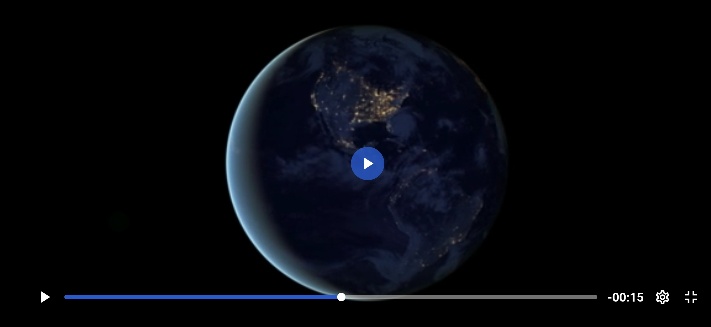 |

<br><br>

### Settings Menu

|                Principal Menu                |                Quality Menu                 |
| :------------------------------------------: | :-----------------------------------------: |
| 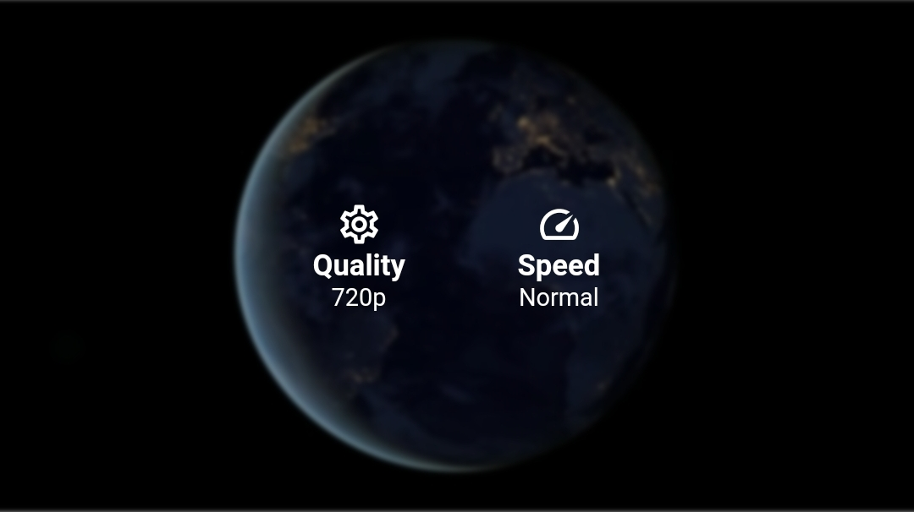 |  |

<br><br>

### Volume Bar

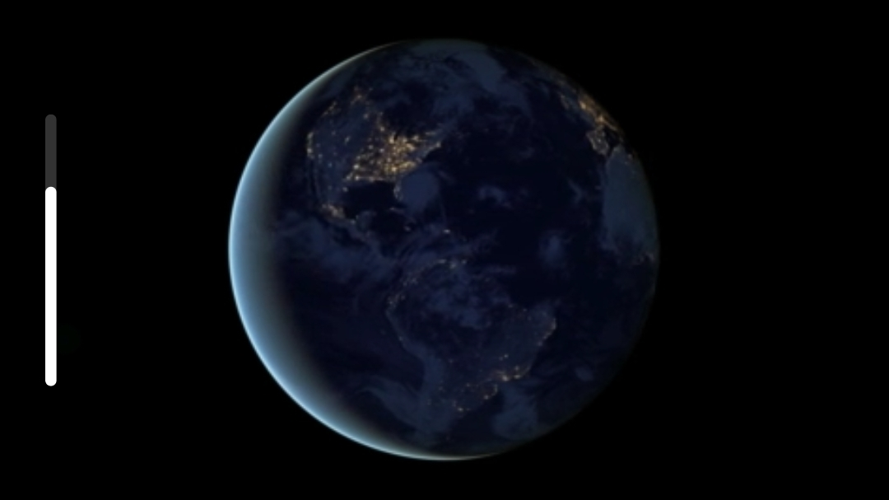

<br><br>

<br><br>

## **WEB**

|               Playing                |               Paused                |
| :----------------------------------: | :---------------------------------: |
| 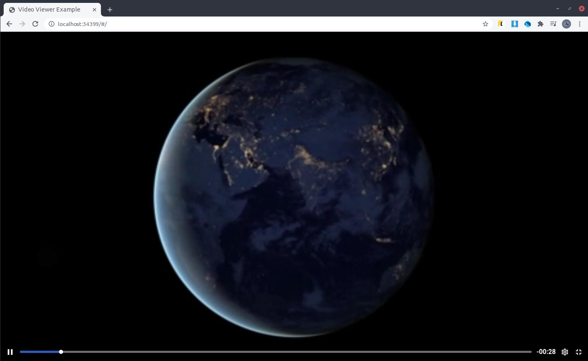 | 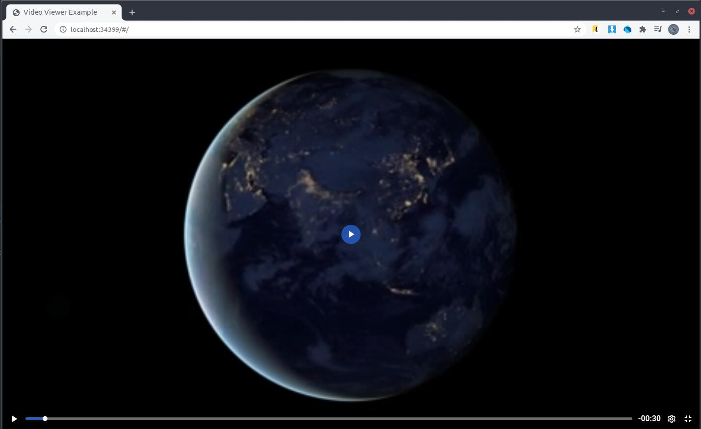 |

<br><br>

### Rewind and Forward

| Double Tap and Keyboard.arrowLeft Rewind | Double Tap and Keyboard.arrowRight Forward |
| :--------------------------------------: | :----------------------------------------: |
|   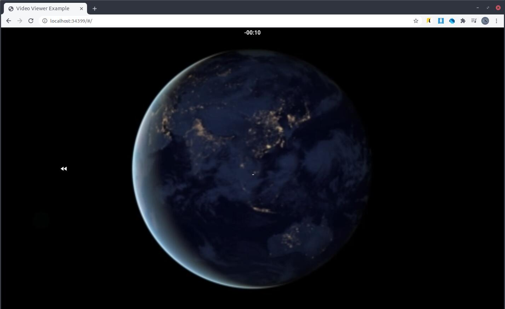    |    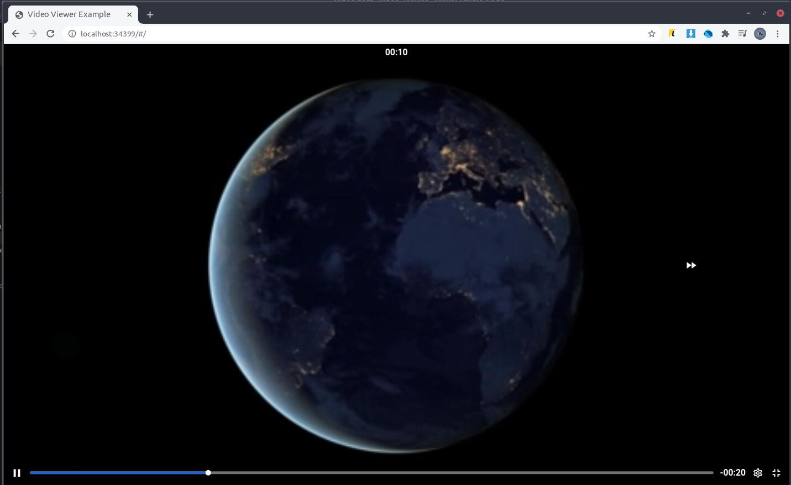    |

<br><br>

### Settings Menu

|               Principal Menu               |               Speed Menu                |
| :----------------------------------------: | :-------------------------------------: |
| 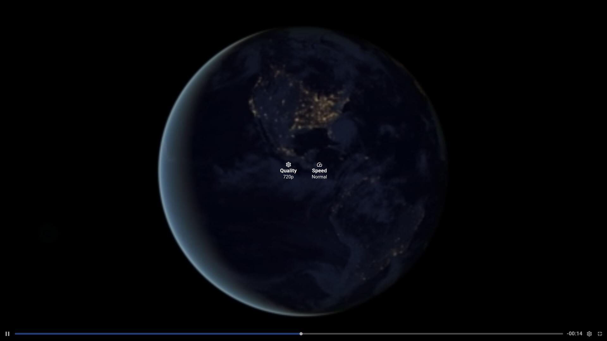 |  |

<br><br>

### FullScreen

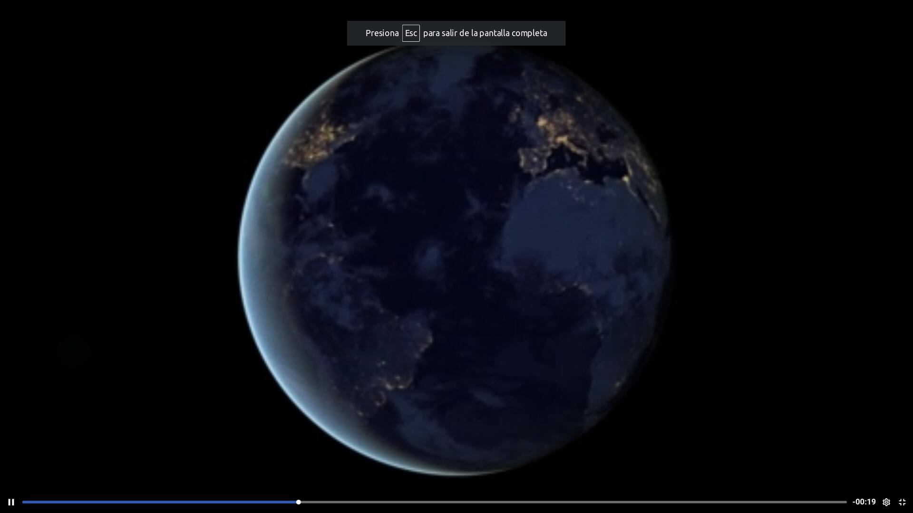

<br><br>

### Volume Bar

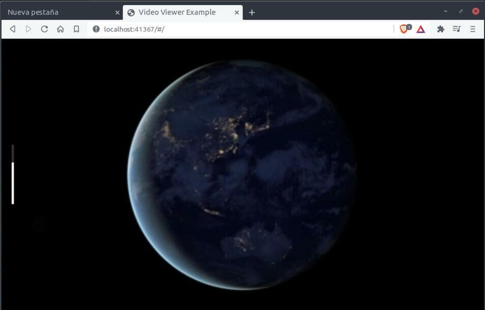
<br><br>

---

<br><br>

## **EXAMPLES**

### Using **VideoViewerController**

```dart
class UsingVideoControllerExample extends StatefulWidget {
  UsingVideoControllerExample({Key key}) : super(key: key);

  @override
  _UsingVideoControllerExampleState createState() =>  _UsingVideoControllerExampleState();
}

class _UsingVideoControllerExampleState extends State<UsingVideoControllerExample> {
  final VideoViewerController controller = VideoViewerController();

  @override
  Widget build(BuildContext context) {
    return VideoViewer(
      controller: controller,
      source: {
        "SubRip Text": VideoSource(
          video: VideoPlayerController.network(
              "https://www.speechpad.com/proxy/get/marketing/samples/standard-captions-example.mp4"),
          subtitle: {
            "English": VideoViewerSubtitle.network(
              "https://pastebin.com/raw/h9cP6N5N",
              type: SubtitleType.webvtt,
            ),
          },
        )
      },
    );
  }

  VideoPlayerController getVideoPlayer() => controller.controller;
  String getActiveSourceName() => controller.activeSource;
  String getActiveCaption() => controller.activeCaption;
  bool isFullScreen() => controller.isFullScreen;
  bool isBuffering() => controller.isBuffering;
  bool isPlaying() => controller.isPlaying;
}
```

<br><br>

### Network Videos

```dart
class NetworkVideoExample extends StatelessWidget {
  const NetworkVideoExample({Key key}) : super(key: key);

  @override
  Widget build(BuildContext context) {
    final Map<String, String> src = {
      "1080p":
          "http://commondatastorage.googleapis.com/gtv-videos-bucket/sample/ForBiggerBlazes.mp4",
      "720p":
          "https://file-examples-com.github.io/uploads/2017/04/file_example_MP4_480_1_5MG.mp4",
    };

    return VideoViewer(
      onFullscreenFixLandscape: false,
      language: VideoViewerLanguage.es,
      source: VideoSource.getNetworkVideoSources(src),
      style: VideoViewerStyle(
        thumbnail: Image.network(
            "https://rockcontent.com/es/wp-content/uploads/2019/02/thumbnail.png"),
        header: Container(
          width: double.infinity,
          padding: EdgeInsets.symmetric(horizontal: 10, vertical: 20),
          child: Column(
            mainAxisSize: MainAxisSize.min,
            crossAxisAlignment: CrossAxisAlignment.start,
            children: [
              Text("MY AMAZING VIDEO",
                  style: TextStyle(
                      fontSize: 18,
                      fontWeight: FontWeight.bold,
                      color: Colors.white)),
              Text("YES!", style: TextStyle(color: Colors.white)),
            ],
          ),
        ),
      ),
      settingsMenuItems: [
        SettingsMenuItem(
          mainMenu: Text("OTHERS",
              style: TextStyle(
                  fontSize: 18,
                  fontWeight: FontWeight.bold,
                  color: Colors.white)),
          secondaryMenu: Column(
            mainAxisSize: MainAxisSize.min,
            children: [
              Text("CHANGE ROTATION", style: TextStyle(color: Colors.white)),
              Text("SCREENSHOT", style: TextStyle(color: Colors.white)),
            ],
          ),
        ),
      ],
    );
  }
}
```

<br><br>

### HLS Network Video **(This example only works on Android and iOS)**

```dart
class HLSVideoExample extends StatelessWidget {
  const HLSVideoExample({Key key}) : super(key: key);

  @override
  Widget build(BuildContext context) {
    return FutureBuilder(
      future: createHLSFiles(
          "https://sfux-ext.sfux.info/hls/chapter/105/1588724110/1588724110.m3u8"),
      builder: (_, data) {
        if (data.hasData)
          return VideoViewer(source: data.data);
        else
          return CircularProgressIndicator();
      },
    );
  }

  ///USE [path_provider] AND [dart.io] **(Only available on Android and iOS)**
  Future<Map<String, VideoSource>> createHLSFiles(String url) async {
    final Directory directory = await getApplicationDocumentsDirectory();
    final Map<String, String> files = await VideoSource.getm3u8VideoFileData(url);
    Map<String, VideoSource> sources = {
      "Auto": VideoSource(video: VideoPlayerController.network(url)),
    };

    for (String quality in files.keys) {
      final File file = File('${directory.path}/hls$quality.m3u8');
      await file.writeAsString(files[quality]);
      sources["${quality.split("x").last}p"] =
          VideoSource(video: VideoPlayerController.file(file));
    }

    return sources;
  }
}
```

<br><br>

### Network Video with WebVTT Subtitles

```dart
class WebVTTSubtitleVideoExample extends StatelessWidget {
  const WebVTTSubtitleVideoExample({Key key}) : super(key: key);

  @override
  Widget build(BuildContext context) {
    return VideoViewer(
      source: {
        "WebVTT Caption": VideoSource(
          video: VideoPlayerController.network(
              "https://www.speechpad.com/proxy/get/marketing/samples/standard-captions-example.mp4"),
          subtitle: {
            "English": VideoViewerSubtitle.network(
              "https://pastebin.com/raw/h9cP6N5N",
              type: SubtitleType.webvtt,
            ),
            "Spanish": VideoViewerSubtitle.network(
              "https://pastebin.com/raw/wrz69aay",
              type: SubtitleType.webvtt,
            ),
          },
        )
      },
    );
  }
}
```

<br><br>

### Network Video with SubRip Subtitles

```dart
class SubRipSubtitleVideoExample extends StatelessWidget {
  const SubRipSubtitleVideoExample({Key key}) : super(key: key);

  @override
  Widget build(BuildContext context) {
    final String content = '''
      1
      00:00:03,400 --> 00:00:06,177
      In this lesson, we're going to
      be talking about finance. And

      2
      00:00:06,177 --> 00:00:10,009
      one of the most important aspects
      of finance is interest.

      3
      00:00:10,009 --> 00:00:13,655
      When I go to a bank or some
      other lending institution

      4
      00:00:13,655 --> 00:00:17,720
      to borrow money, the bank is happy
      to give me that money. But then I'm

      5
      00:00:17,900 --> 00:00:21,480
      going to be paying the bank for the
      privilege of using their money. And that

      6
      00:00:21,660 --> 00:00:26,440
      amount of money that I pay the bank is
      called interest. Likewise, if I put money

      7
      00:00:26,620 --> 00:00:31,220
      in a savings account or I purchase a
      certificate of deposit, the bank just

      8
      00:00:31,300 --> 00:00:35,800
      doesn't put my money in a little box
      and leave it there until later. They take

      9
      00:00:35,800 --> 00:00:40,822
      my money and lend it to someone
      else. So they are using my money.

      10
      00:00:40,822 --> 00:00:44,400
      The bank has to pay me for the privilege
      of using my money.

      11
      00:00:44,400 --> 00:00:48,700
      Now what makes banks
      profitable is the rate

      12
      00:00:48,700 --> 00:00:53,330
      that they charge people to use the bank's
      money is higher than the rate that they

      13
      00:00:53,510 --> 00:01:00,720
      pay people like me to use my money. The
      amount of interest that a person pays or

      14
      00:01:00,800 --> 00:01:06,640
      earns is dependent on three things. It's
      dependent on how much money is involved.

      15
      00:01:06,820 --> 00:01:11,300
      It's dependent upon the rate of interest
      being paid or the rate of interest being

      16
      00:01:11,480 --> 00:01:17,898
      charged. And it's also dependent upon
      how much time is involved. If I have

      17
      00:01:17,898 --> 00:01:22,730
      a loan and I want to decrease the amount
      of interest that I'm going to pay, then

      18
      00:01:22,800 --> 00:01:28,040
      I'm either going to have to decrease how
      much money I borrow, I'm going to have

      19
      00:01:28,220 --> 00:01:32,420
      to borrow the money over a shorter period
      of time, or I'm going to have to find a

      20
      00:01:32,600 --> 00:01:37,279
      lending institution that charges a lower
      interest rate. On the other hand, if I

      21
      00:01:37,279 --> 00:01:41,480
      want to earn more interest on my
      investment, I'm going to have to invest

      22
      00:01:41,480 --> 00:01:46,860
      more money, leave the money in the
      account for a longer period of time, or

      23
      00:01:46,860 --> 00:01:49,970
      find an institution that will pay
      me a higher interest rate.
      ''';

    return VideoViewer(
      source: {
        "SubRip Caption": VideoSource(
          video: VideoPlayerController.network(
              "https://www.speechpad.com/proxy/get/marketing/samples/standard-captions-example.mp4"),
          subtitle: {
            "English": VideoViewerSubtitle.content(
              content,
              type: SubtitleType.srt,
            ),
          },
        )
      },
    );
  }
}
```
